## 上机实验一 实验报告

熊泽恩 2022011223 计24

### 输出姓名、学号、院系名称、班级名称


### 输出学校名称、课程名称、选课时间、上课地点

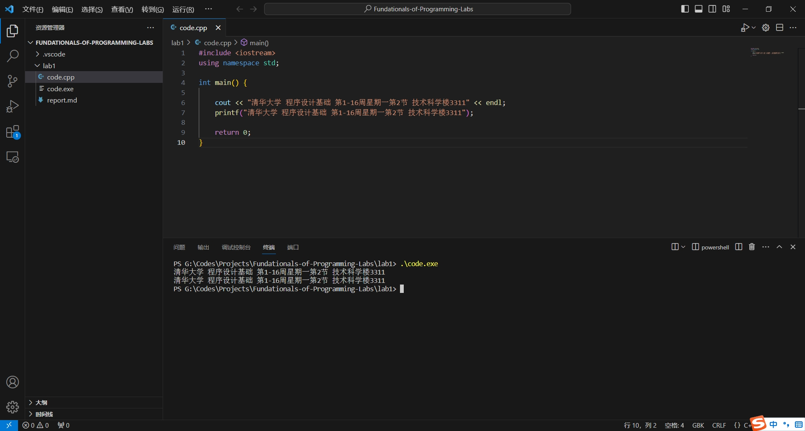

### 在头文件包含行的最后添加分号，观察编译现象

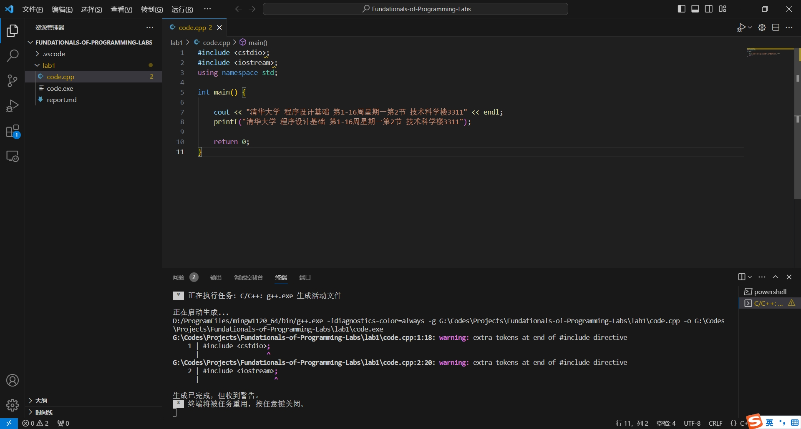

编译信息为 `warning: extra tokens at end of #include directive`，说明这是一个警告而不是错误（不需要修改就可以 **编译** 成功，但 **运行** 上可能会出现逻辑问题），产生的原因是 `#include` 头文件包含句末尾多加了一些符号（此例为分号）。

### 将#改为全角字符，观察编译现象

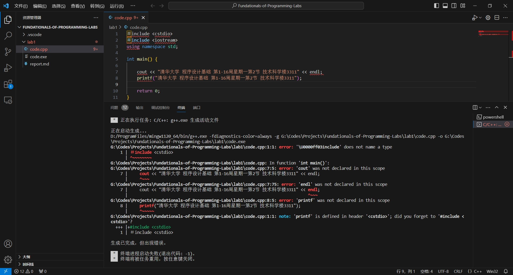

编译器首先报错 `\U0000ff03include does not name a type`。`\U0000ff03` 是全角#号的 UTF-8 编码，所以它不会被解析成半角井号，也就发生了语法错误。这导致 `iostream` 和 `cstdio` 两个头文件并没有被包含进来。

由于 `#include` 失效，所以 `cout`、`endl`、`printf` 也就没有了定义，所以会报后面的错。

### 去掉头文件包含行最前面的#符号，观察编译现象

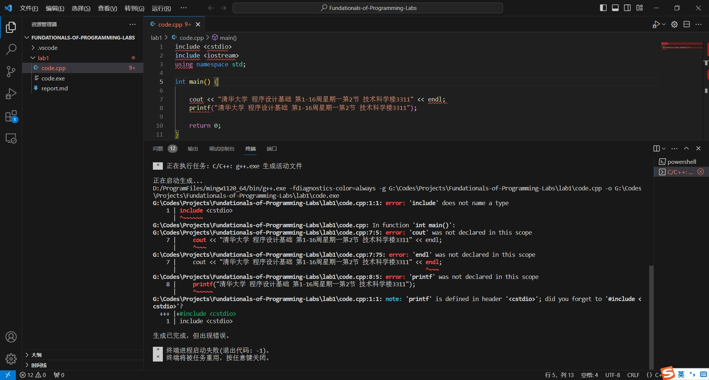

这个错误和上一个是类似的，没有了半角井号，就不满足头文件包含的语法，这导致 `iostream` 和 `cstdio` 两个头文件并没有被包含进来，所以 `cout`、`endl`、`printf` 也就没有了定义。

### 将头文件包含中的尖括号改为全角字符（要打开中文输入），观察编译现象

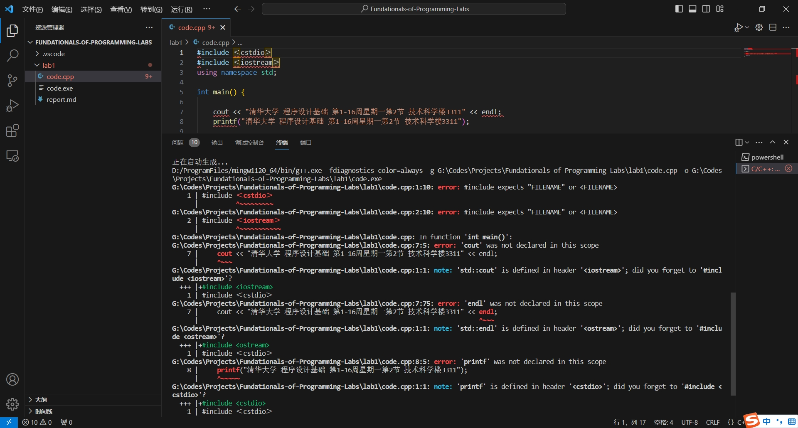

这个错误和上一个是类似的，尖括号改为全角字符，就不满足头文件包含的语法。**C++中不支持使用全角字符来替代对应的半角字符。** 这导致 `iostream` 和 `cstdio` 两个头文件仍然没有被包含进来，所以 `cout`、`endl`、`printf` 也就没有了定义。

### 通过加注释符号，将程序中对头文件的包含注释掉，观察编译现象

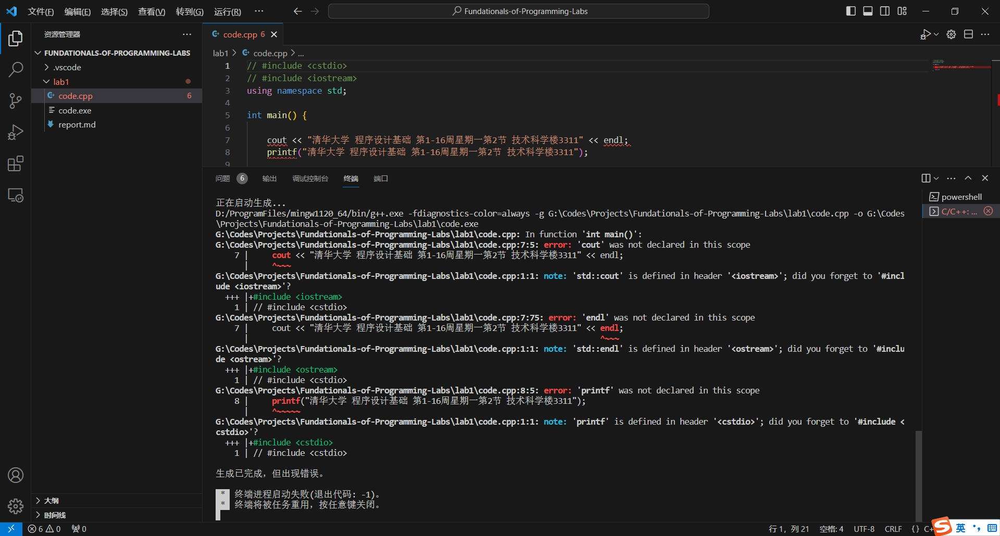

注释掉头文件之后，`cout`、`endl`、`printf` 也就没有了定义，所以在使用它们的时候，编译器不知道它们是什么东西，所以会报错。

### 修改 using namespace std; 中单词的大小写或拼写，观察编译现象

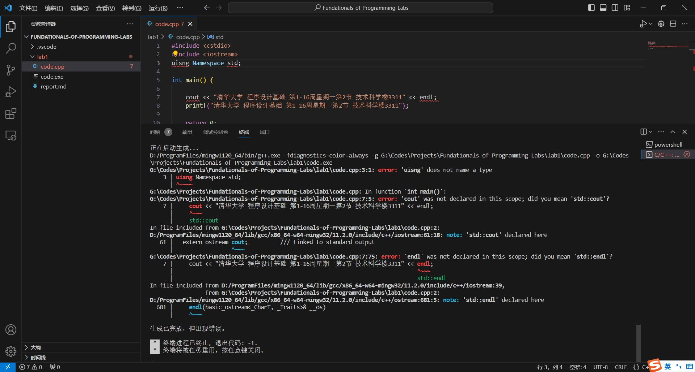

C++是一门 **大小写敏感** 的编程语言，所以改掉任何的大小写都是不行的。更改拼写也是不行的。

### 去掉 using namespace std; 观察编译现象

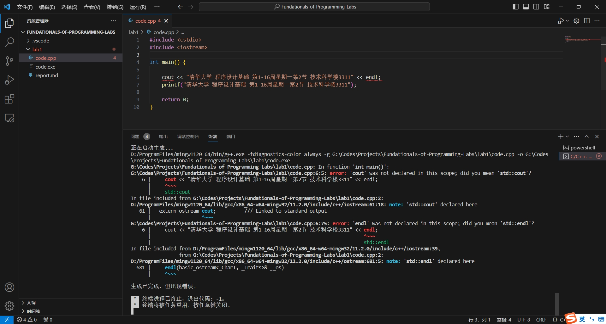

`iostream` 中的 `cout` 和 `endl` 都是声明在 `std` 这一个命名空间中的，所以不全局说明自己默认使用 `std` 命名空间会导致编译器不理解 `cout` 和 `endl` 是什么。

除了在程序开头直接说明 `using namespace std;` 之外，另一个可行的解决办法是在使用 `cout` 和 `endl` 的时候显式地说明它们的命名空间：

```cpp
std::cout << "清华大学 程序设计基础 第1-16周星期一第2节 技术科学楼3311" << std::endl;
```

### 将main改为Main，观察编译现象

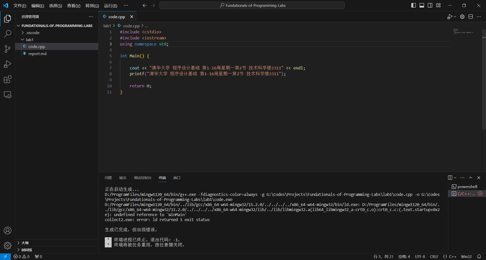

一个C++程序需要一个 `main` 函数作为程序入口，而且C++是大小写敏感的一个语言，所以 `Main` 是不行的。

编译器报错 `undefined refercence to 'WinMain'`，这说明没有找到 `main` 函数作为程序入口，所以不知道该从哪里开始运行这个程序，因此报错。

### 在cout输出语句中<<的小于号中间插入一个或多个空格，观察编译现象

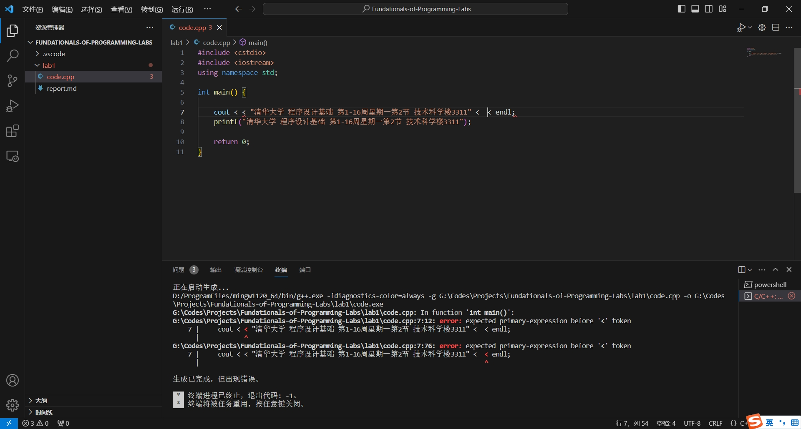

如果在小于号中间插入一个或多个空格，那么 `<  <` 就不会被解读成输出流的运算符，而是两个小于号，那么肯定会报错。小于号两侧都需要 `primary expression` 作为被比较的量，所以会报错：

`error: expected primary expreesion before '<' token`

### 将双引号改为全角字符，观察编译现象


如果用全角字符包裹要输出的信息，那么它就 **不会被解释成一个字符串常量**。字符串常量一定是要用半角双引号包裹起来的。

### 去掉输出语句后的分号，观察编译现象


C++中以分号作为一个语句的结尾，就像中文里句号是一句话的结尾一样。所以去掉分号之后，编译器提示错误 `error: expected ';' before 'printf'`。

### 去掉main中的return 0; 观察编译现象

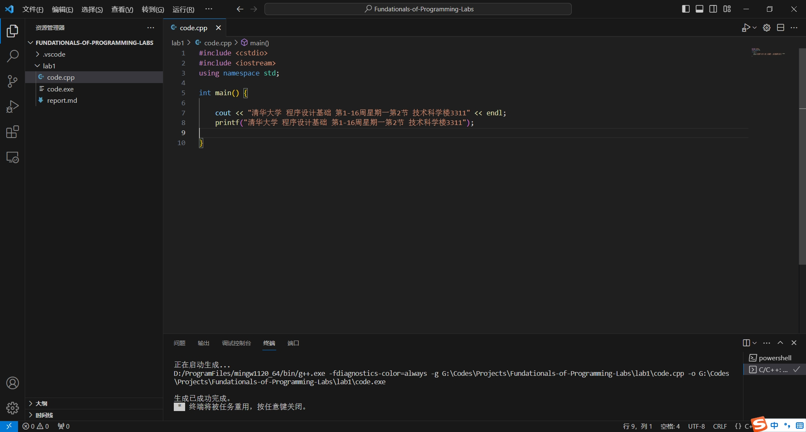

编译没有出错，但是这是不推荐的。作为以 `int` 为返回类型的 `main` 函数，应当在函数结束的时候返回一个整型数。如果程序正常结束，应该返回 0。
