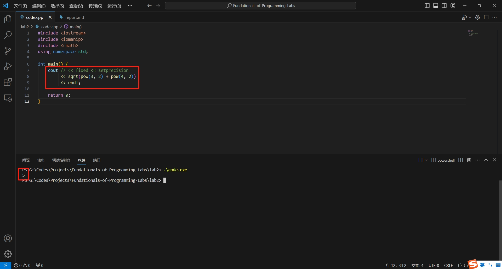
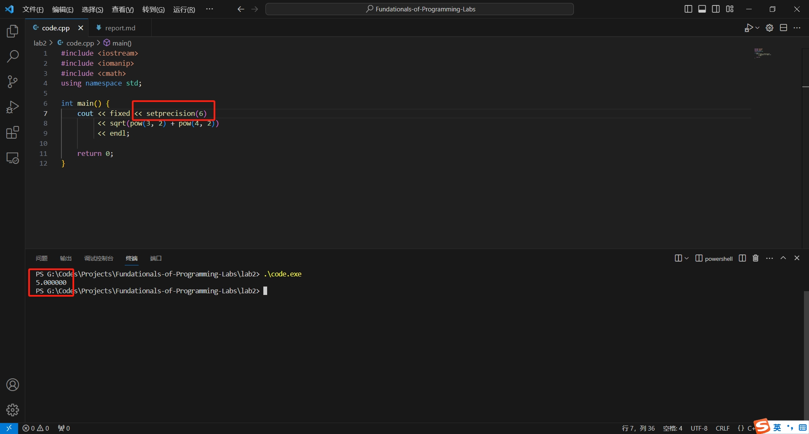

## 上机实验二

### 猜想一：`sqrt(pow(3, 2) + pow(4, 2))` 没有问题。

当我直接输出 `sqrt(pow(3, 2) + pow(4, 2))`，得到的结果的确是 `5`。这说明问题不是 `sqrt` 和 `pow` 两个函数引起的。

### 猜想二：`setprecision` 有问题。

上述代码及其运行结果说明，直接输出 `setprecision` 会输出 `1`。这表明，某学生的得到的输出 `15.000000` 是由 `setprecision` 的 `1` 和后续的 `5.000000` 构成的，它并不是十五，而是一五！这并没有达到该生的预期结果，但我们定位出一定是 `setprecision` 的使用方法出了问题。

### 猜想三：`setprecision` 需要一个参数。

经过查阅相关资料 [std::setprecision - cppreference.com](https://en.cppreference.com/w/cpp/io/manip/setprecision)，我发现 `setprecision` 的正确用法是 `cout << fixed << setprecision(6) << 1.234567 << endl;`。

如果添加 `fixed` 则其中参数为输出是固定的 **小数点后位数**。如果不添加 `fixed` 则其中参数为输出时固定的 **有效数字的位数**。

上述代码及其运行结果说明，这才是 `setprecision(n)` 的正确用法。

### 总结

编程中需要注意及时查阅使用的库函数的官方文档及其使用方法，避免意料之外的错误。在此例中，查询 [std::setprecision - cppreference.com](https://en.cppreference.com/w/cpp/io/manip/setprecision) 就显得极为重要，这让我更加了解 `std::setprecision` 的使用方法。

调试此类程序错误时，需要对程序可能出错的地方进行预估，然后将代码分割成相互没有关联的多个测试单元，每个测试单元单独拿出来测试。如果某个测试单元的代码没有出错，那么错误只会发生在另外的测试单元中。这样挨个儿排查，就能最终定位出错误具体发生的位置，方便我们调试以及修改相应代码。
