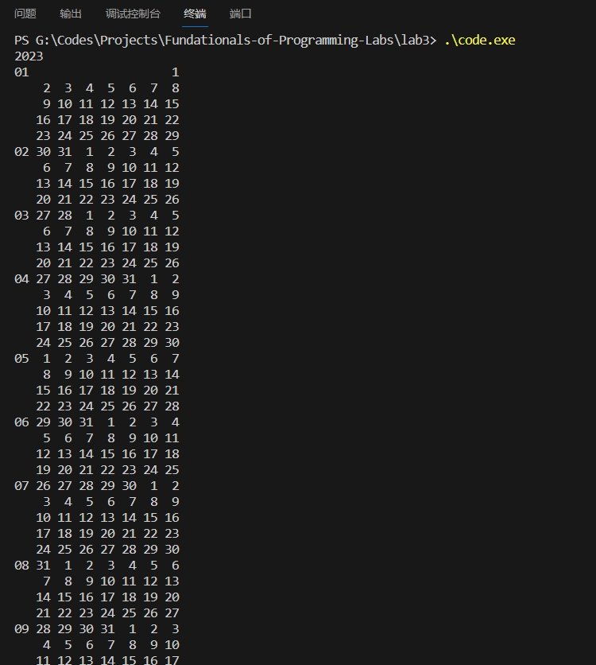
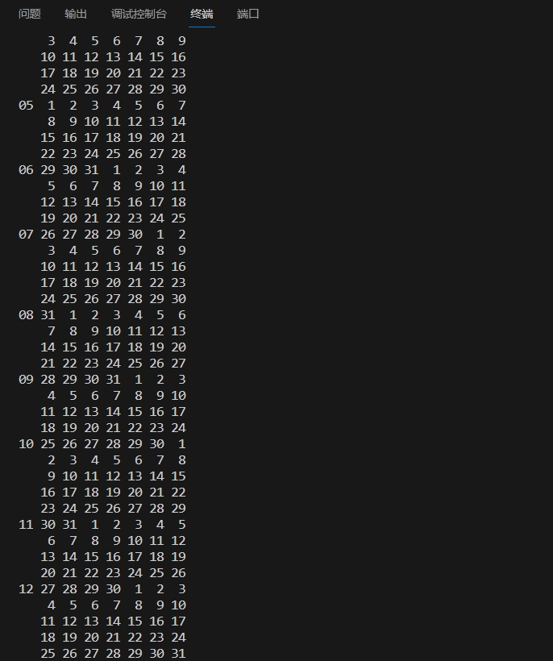
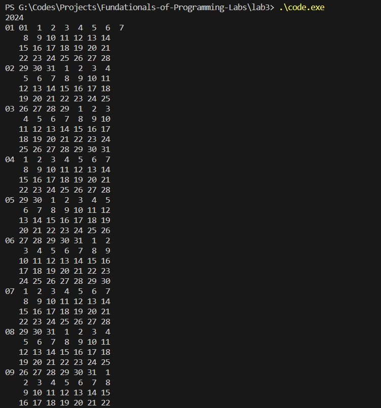
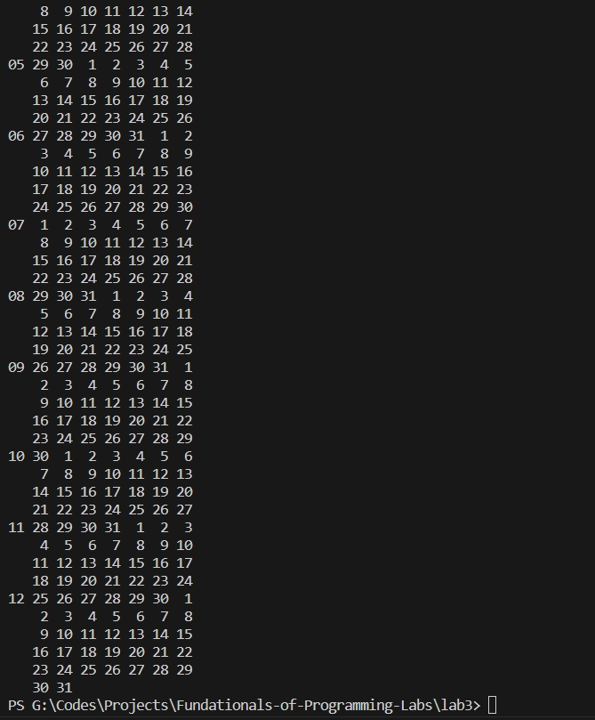

## 上机实验三

计24 2022011223 熊泽恩

### 屏幕截图

#### 平年样例





#### 闰年样例





### 代码实现

```cpp
#include <bits/stdc++.h>

int DAYS_IN_A_MONTH[] = {-1, 31, 28, 31, 30, 31, 30, 31, 31, 30, 31, 30, 31};

int _year;

// 判断一个年份 year 是否是闰年
bool isLeapYear(int year) {
    return (year % 4 == 0 && year % 100 != 0) || (year % 400 == 0);
}

// 获取 year 年的 month 月一共有多少天
int daysOfMonth(int year, int month) {
    return (isLeapYear(year) && month == 2) ? (DAYS_IN_A_MONTH[month] + 1) : DAYS_IN_A_MONTH[month];
}

// 计算日期到 2023 年 1 月 1 日的天数
int dateToInt(int year, int month, int day) {
    int days = 0;
    for (int y = 2023; y < year; y++)
        days += isLeapYear(y) ? 366 : 365;
    for (int m = 1; m < month; m++)
        days += daysOfMonth(year, m);
    days += day - 1;
    return days;
}

// 计算两个日期之间的天数间隔，是它们距离 2023 年 1 月 1 日的天数之差
int daysBetweenDates(int year1, int month1, int day1, int year2, int month2, int day2) {
    int days1 = dateToInt(year1, month1, day1);
    int days2 = dateToInt(year2, month2, day2);
    return std::abs(days1 - days2);
}

// 得到 (year, month, day) 的后一天的年，月，日
void nextDay(int& year, int& month, int& day) {
    int daysInMonth = daysOfMonth(year, month);
    day++;
    if (day > daysInMonth) {
        day = 1;
        month++;
        if (month > 12) {
            month = 1;
            year++;
        }
    }
}

// 获取某个日期是星期几
int getWeekday(int year, int month, int day) {
    int w = daysBetweenDates(year, month, day, 2023, 1, 1) % 7;
    return w ? w : 7;
}

int main() {

    scanf("%d", &_year);

    // 处理第一行
    printf ("01 ");
    for (int i = 1; i < getWeekday(_year, 1, 1); i++)
        printf("   ");

    // 从 _year 年 1 月 1 日开始，往后循环枚举
    for (int y = _year, m = 1, d = 1; y == _year; nextDay(y, m, d)) {

        // 考虑这一行的开头需不需要显示月份
        if (getWeekday(y, m, d) == 1) {
            if (d == 1)
                printf("%02d ", m);
            else if (daysBetweenDates(y, m, d, y, m + 1, 1) < 7 && m < 12)
                printf("%02d ", m + 1);
            else
                printf("   ");
        }
        
        // 如果是星期天，则需要换行
        printf(getWeekday(y, m, d) == 7 ? "%2d\n" : "%2d ", d);
    }

    return 0;
}
```