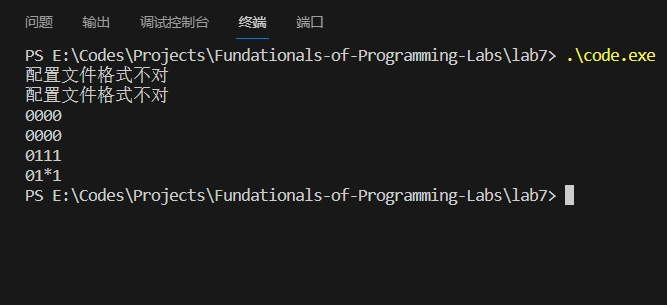
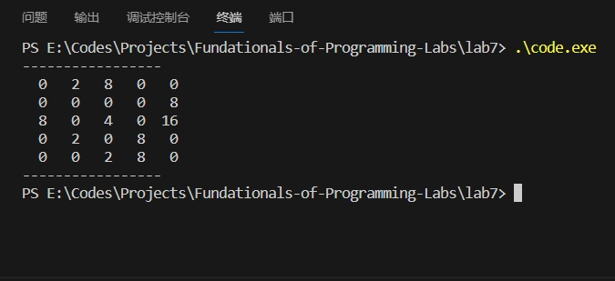
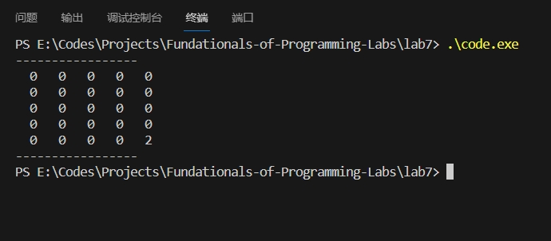
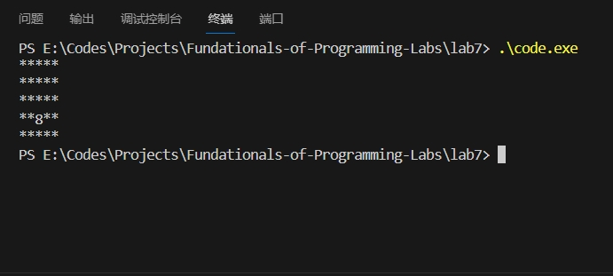
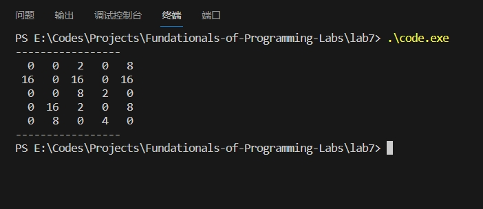

## 上机实验七

### 代码实现

```cpp
#include <bits/stdc++.h>

const int N = 20 + 5;
char configFileName[] = "config.txt";
char cmdFileName[] = "cmd.txt";

int a[N][N], b[N][N], c[1 << N], dir, ratio;
char opt[1];
int matrixSize, randValue;

// 随机出 [l, r] 中的一个整数
int random(int l, int r) {
    return rand() * rand() % (r - l + 1) + l;
}

// 输出整个 matrixSize*matrixSize 矩阵的函数
void print() {
    puts("-----------------");
    for (int i = 1; i <= matrixSize; i++) {
        for (int j = 1; j <= matrixSize; j++)
            printf("%3d ", a[i][j]);
        puts("");
    }
    puts("-----------------");
}

// 判断一个数是否为整数
bool isReal(double f) {
    return f == (int) f;
}

// 除去 str 里的所有空格
void removeSpaces(char *str) {
    int count = 0;
    for (int i = 0; str[i]; i++) {
        if (!isspace((unsigned char)str[i])) {
            str[count++] = str[i];
        }
    }
    str[count] = '\0';
}

// 检查 str 是否为整数字符串
int getDigit(char *str) {
    int ans = 0;
    for (int i = 0; str[i]; i++) {
        if (!isdigit(str[i]))
            return -1;
        else
            ans = ans * 10 + str[i] - '0';
    }
    return ans;
}

// 读取 config.txt 文件
int readMatrixSizeFromConfig(char *filename) {
    FILE *file = fopen(filename, "r");
    int size = 4;  // 默认大小为4
    int found = 0;  // 用于标记是否找到符合条件的行

    if (file != NULL) {
        char line[100];
        char foundLine[100] = "";  // 用于保存找到的"SIZE = N"格式的行
        while (fgets(line, sizeof(line), file)) {
            if (line[0] != '#') {  // 忽略以#开头的行
                removeSpaces(line);
                char *pos = strstr(line, "SIZE=");
                if (pos == line) {
                    char *tmp = pos + 5;
                    int x = getDigit(tmp);
                    if (x != -1 && x > 0) {
                        found = 1;
                        size = x;
                    }
                }
            }
        }

        if (!found) {  // 如果没有找到符合条件的行
            printf("配置文件格式不对\n");
        }
        fclose(file);
    } else {
        printf("配置文件格式不对\n");
    }

    return size;
}

// 读取 RAND 值
int readRandomValueFromConfig(char *filename) {
    FILE *file = fopen(filename, "r");
    int value = -1;
    int found = 0;  // 用于标记是否找到符合条件的行

    if (file != NULL) {
        char line[100];
        char foundLine[100] = "";  // 用于保存找到的"RAND = R"格式的行
        while (fgets(line, sizeof(line), file)) {
            if (line[0] != '#') {  // 忽略以#开头的行
                removeSpaces(line);
                char *pos = strstr(line, "RAND=");
                if (pos == line) {
                    char *tmp = pos + 5;
                    int x = getDigit(tmp);
                    if (x != -1 && x >= 0 && x < 100) {
                        found = 1;
                        value = x;
                    }
                }
            }
        }

        if (!found) {  // 如果没有找到符合条件的行
            printf("配置文件格式不对\n");
        }
        fclose(file);
    } else {
        printf("配置文件格式不对\n");
    }

    return value;
}

// 进行冒泡操作
void bubble() {
    for (int j = 1; j <= matrixSize; j++) { // 枚举列
        for (int i = matrixSize - 1; i >= 1; i--) { // 枚举行
            for (int k = i; k <= matrixSize - 1; ++k) { // 从上到下，替换 0
                if (a[k + 1][j] == 0) // 如果下一位为 0
                    std::swap(a[k][j], a[k + 1][j]); // 交换，类似于“冒泡”操作
            }
        }
    }
}

// 进行消融操作
void calc() {
    for (int j = 1; j <= matrixSize; j++) {
        for (int i = 1; i <= matrixSize - 1; ) {
            if (a[i][j] == a[i + 1][j]) {
                a[i + 1][j] *= 2;
                a[i][j] = 0;
                i += 2;
            } else
                i++;
        }
    }
}

// 随机往有数字 0 的位置，按 R% 的比例将内容修改为 2 或 4
void modify() {
    int cnt = 0;
    for (int i = 1; i <= matrixSize; i++)
        for (int j = 1; j <= matrixSize; j++)
            cnt += a[i][j] == 0; // 先计算有多少个 0

    int num = cnt * randValue / 100;
    int arr[N * N] = { 0 };
    for (int i = 1; i <= num; i++) // 有 num 个位置，需要进行修改
        arr[i] = 1;
   	// arr[i] == 0 表示第 i 个 0 不需要修改
    // arr[i] == 1 表示第 i 个 0 需要修改
    std::random_shuffle(arr + 1, arr + cnt + 1); // 随机出是哪 R% 个

    cnt = 0;
    for (int i = 1; i <= matrixSize; i++) {
        for (int j = 1; j <= matrixSize; j++) {
            cnt += a[i][j] == 0;
            if (a[i][j] == 0 && arr[cnt]) { // 如果当前位置需要修改
                a[i][j] = random(0, 1) ? 2 : 4; // 修改为 2 或 4
                return;
            }
        }
    }
}

// 判断一个格子是否合法 / 里面是否为 *
bool valid(int x, int y) {
    return x >= 1 && x <= matrixSize && y >= 1 && y <= matrixSize && a[x][y] != 0;
}

void operate(char *filename) {
    FILE *file = fopen(filename, "r");
    if (file != NULL) {
        freopen("cmd.txt", "r", stdin);
        print();
        while (scanf("%s", opt) != EOF) {
            if (opt[0] == 'C') { // C 表示 Compress
                scanf("%d", &dir);
                switch (dir) {
                    case 0: // 向上
                        for (int j = 1; j <= matrixSize; j++) { // 枚举列
                            int sum = 0;
                            for (int i = 1; i <= matrixSize; i++) { // 枚举行，求和
                                sum += a[i][j];
                                a[i][j] = 0; // 其余单元改为 0
                            }
                            a[1][j] = sum;
                        }
                        break;
                    case 1: // 向左
                        for (int i = 1; i <= matrixSize; i++) { // 枚举行
                            int sum = 0;
                            for (int j = 1; j <= matrixSize; j++) { // 枚举列，求和
                                sum += a[i][j];
                                a[i][j] = 0; // 其余单元改为 0
                            }
                            a[i][1] = sum;
                        }
                        break;
                    case 2: // 向下
                        for (int j = 1; j <= matrixSize; j++) { // 枚举列
                            int sum = 0;
                            for (int i = 1; i <= matrixSize; i++) { // 枚举行，求和
                                sum += a[i][j];
                                a[i][j] = 0; // 其余单元改为 0
                            }
                            a[matrixSize][j] = sum;
                        }
                        break;
                    case 3: // 向右
                        for (int i = 1; i <= matrixSize; i++) { // 枚举行
                            int sum = 0;
                            for (int j = 1; j <= matrixSize; j++) { // 枚举列，求和
                                sum += a[i][j];
                                a[i][j] = 0; // 其余单元改为 0
                            }
                            a[i][matrixSize] = sum;
                        }
                        break;
                    default:
                        continue;
                }
            } else if (opt[0] == 'R') { // R 表示 Rotate
                scanf("%d", &dir);
                for (int i = 1; i <= matrixSize; i++)
                    for (int j = 1; j <= matrixSize; j++)
                        b[i][j] = a[matrixSize + 1 - j][i]; // 向右旋转 90 度，复制到 b 数组中
                for (int i = 1; i <= matrixSize; i++)
                    for (int j = 1; j <= matrixSize; j++)
                        a[i][j] = b[i][j]; // 再重新移动回 a 数组
            } else if (opt[0] == 'M') { // M 表示 Melt
                bubble();
                calc();
                bubble();
                modify();
            } else if (opt[0] == 'Q') { // Q 表示 Quit
                break;
            }
            print();
        }
    } else {
        for (int i = 1; i <= matrixSize; i++) {
            for (int j = 1; j <= matrixSize; j++) {
                if (a[i][j]) {
                    putchar('*');
                } else {
                    int star = 0;
                    for (int k = -1; k <= 1; k++) {
                        for (int l = -1; l <= 1; l++) {
                            star += valid(i + k, j + l);
                        }
                    }
                    printf("%d", star);
                }
            }
            puts("");
        }
    }
}

int main() {
    
    srand(time(0));
    matrixSize = readMatrixSizeFromConfig(configFileName);
    randValue = readRandomValueFromConfig(configFileName);

    // printf("matrixSize = %d\nrandValue = %d\n", matrixSize, randValue);

    // 随机填入
    if (randValue == -1 || randValue == 0) {
        c[1] = 1 << random(1, 2);
    } else {
        for (int i = 1; i <= matrixSize * matrixSize * randValue / 100.0; i++) // 一部分为 2 的自然数次幂，其余为 0
            c[i] = 1 << random(1, 4);
    }

    std::random_shuffle(c + 1, c + matrixSize * matrixSize + 1); // 打乱
    for (int i = 1; i <= matrixSize; i++)
        for (int j = 1; j <= matrixSize; j++)
            a[i][j] = c[(i - 1) * matrixSize + j]; // 把长度为 matrixSize^2 的 c 数组整理成矩阵

    // 考虑 cmd.txt 中的操作
    operate(cmdFileName);

    return 0;
}
```

### 测试数据设计

#### 不含有 `config.txt` 且 `cmd.txt` 的情况

此情况为极端情况。不含有 `cmd.txt` 会使程序采取步骤 (4)，而输出 `*` 和周围 `*` 的个数。



#### `cmd.txt` 为空的情况

这是一个边界条件，它与“不存在 `cmd.txt`”不一样。

`config.txt`:

```
SIZE=5
RAND=40
```

`cmd.txt`:

```

```



#### `RAND 0` 或不存在 `RAND` 指令的情况

此时生成的 $2$ 的幂的个数应该为 $1$ 而非 $0$。

`config.txt`:

```
#RAND=10
SIZE=5
RAND=0
```

`cmd.txt`:

```
Q
```



#### `RAND 99` 且不存在 `cmd.txt` 的情况

这是一种边界情况，它会导致几乎所有的矩阵元素均为 `*`。

`config.txt`:

```
SIZE=5
RAND=99
```



#### `config.txt` 中包含重复有效指令和非法指令、有注释、指令参数为浮点数、指令中含有很多空格的情况

`config.txt`:

```
#SIZE=10
SIZE = 10.0
SIZE = 10
SIZE = 5
RAND=100
RAND=10.0
R
     RAND               =                        50
```

`cmd.txt`:

```
Q
```


