## 上机实验 A

熊泽恩 计24 2022011223

### 步骤截图

开始时栈里只有 `main` 函数。

初始状态下的汉诺塔如上图所示，取 $n = 3$。

---

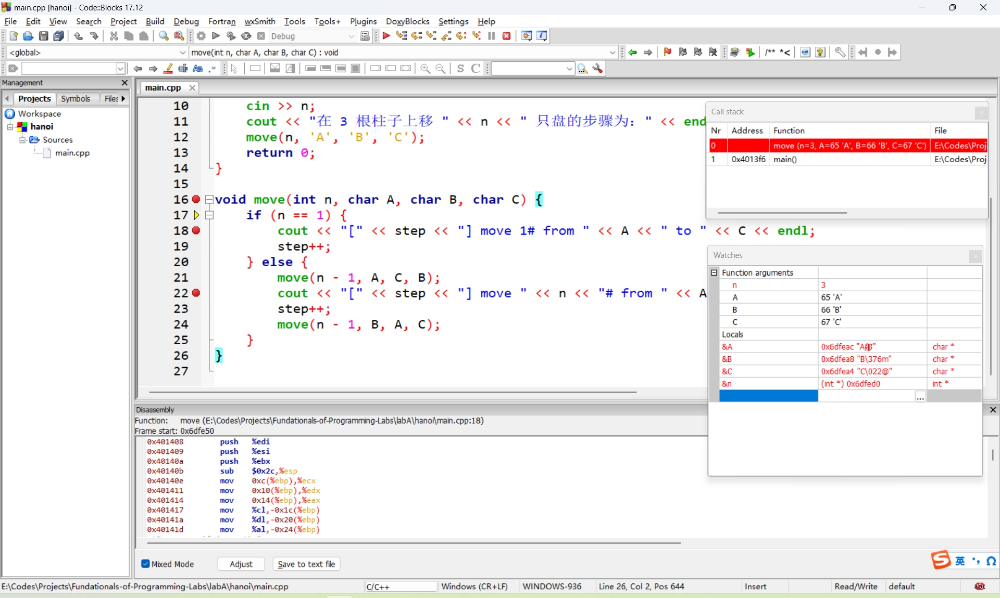

此时栈里压入 `move(3, 'A', 'B', 'C')`，形参地址和内容如下。

|   项目   |    地址    | 内容  |
| :------: | :--------: | :---: |
|   `n`    | `0x6dfed0` |  `3`  |
|   `A`    | `0x6dfeac` | `'A'` |
|   `B`    | `0x6dfea8` | `'B'` |
|   `C`    | `0x6dfea4` | `'C'` |
| 函数返回 | `0x4013f6` |   -   |

---


此时栈里再压入 `move(2, 'A', 'C', 'B')`，形参地址和内容如下，实参地址为父级调用中的形参地址。

|   项目   |    地址    | 内容  |
| :------: | :--------: | :---: |
|   `n`    | `0x6dfe90` |  `2`  |
|   `A`    | `0x6dfe6c` | `'A'` |
|   `B`    | `0x6dfe68` | `'C'` |
|   `C`    | `0x6dfe64` | `'B'` |
| 函数返回 | `0x4014da` |   -   |

---


此时栈里再压入 `move(1, 'A', 'B', 'C')`，形参地址和内容如下，实参地址为父级调用中的形参地址。

|   项目   |    地址    |           内容            |
| :------: | :--------: | :-----------------------: |
|   `n`    | `0x6dfe50` |            `1`            |
|   `A`    | `0x6dfe2c` |           `'A'`           |
|   `B`    | `0x6dfe28` |           `'B'`           |
|   `C`    | `0x6dfe24` |           `'C'`           |
| 函数返回 | `0x4014da` |             -             |
|   输出   |     -      | `[1] move 1# from A to C` |

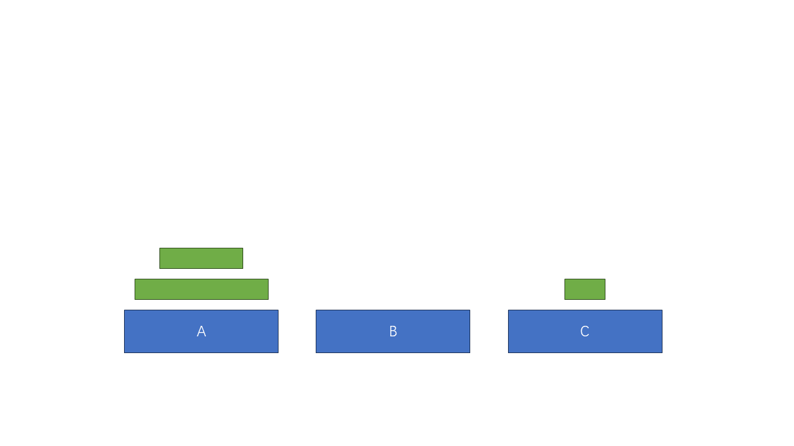

此时汉诺塔状态如上图。

---

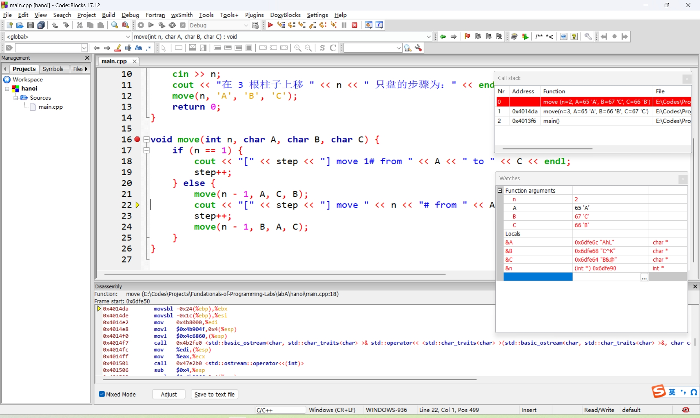

此时处理完 `move(1, 'A', 'B', 'C')`，将其出栈。

| 项目 | 地址 |           内容            |
| :--: | :--: | :-----------------------: |
| 输出 |  -   | `[2] move 2# from A to B` |


此时汉诺塔状态如上图。

---


此时栈里再压入 `move(1, 'C', 'A', 'B')`，形参地址和内容如下，实参地址为父级调用中的形参地址。

|   项目   |    地址    |           内容            |
| :------: | :--------: | :-----------------------: |
|   `n`    | `0x6dfe50` |            `1`            |
|   `A`    | `0x6dfe2c` |           `'C'`           |
|   `B`    | `0x6dfe28` |           `'A'`           |
|   `C`    | `0x6dfe24` |           `'B'`           |
| 函数返回 | `0x4015a7` |             -             |
|   输出   |     -      | `[3] move 1# from C to B` |


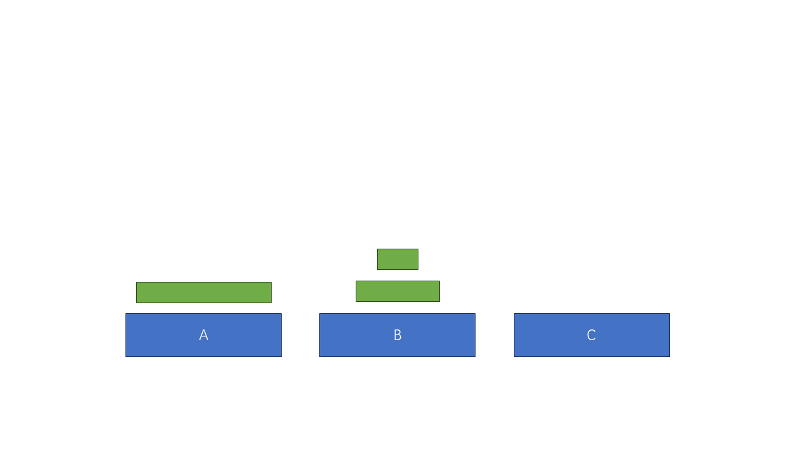此时汉诺塔状态如上图。

---

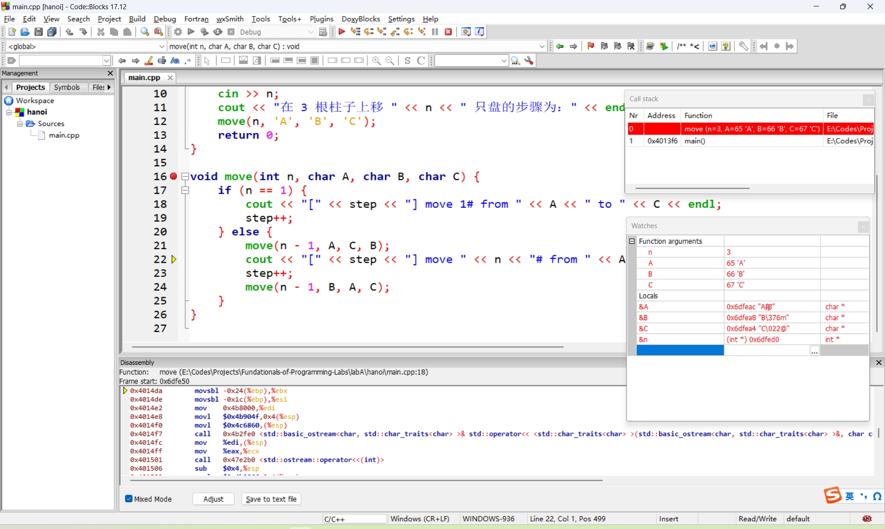

此时处理完 `move(1, 'C', 'A', 'B')`，将其出栈；

紧接着又处理完 `move(2, 'A', 'C', 'B')`，将其出栈。

| 项目 | 地址 |           内容            |
| :--: | :--: | :-----------------------: |
| 输出 |  -   | `[4] move 3# from A to C` |


此时汉诺塔状态如上图。

---

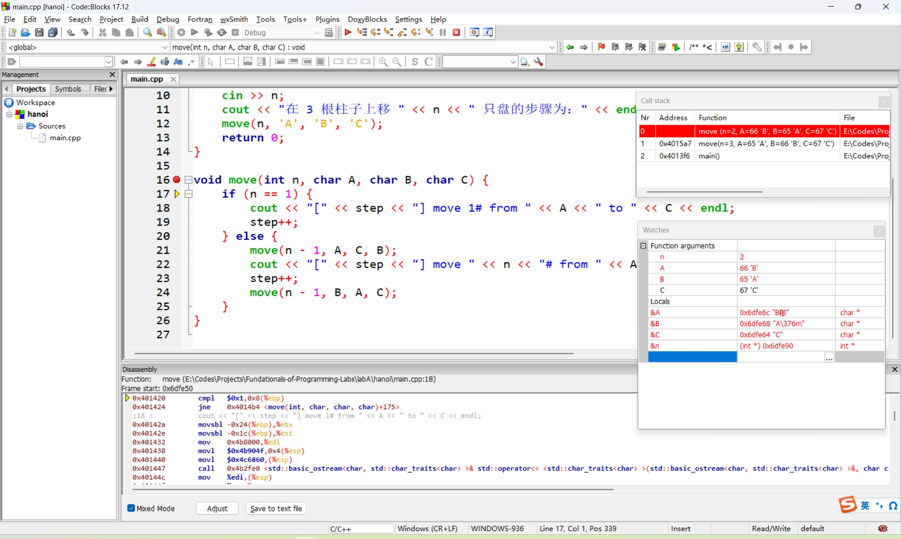

此时栈里再压入 `move(2, 'B', 'A', 'C')`，形参地址和内容如下，实参地址为父级调用中的形参地址。

|   项目   |    地址    | 内容  |
| :------: | :--------: | :---: |
|   `n`    | `0x6dfe90` |  `2`  |
|   `A`    | `0x6dfe6c` | `'B'` |
|   `B`    | `0x6dfe68` | `'A'` |
|   `C`    | `0x6dfe64` | `'C'` |
| 函数返回 | `0x4015a7` |   -   |

---

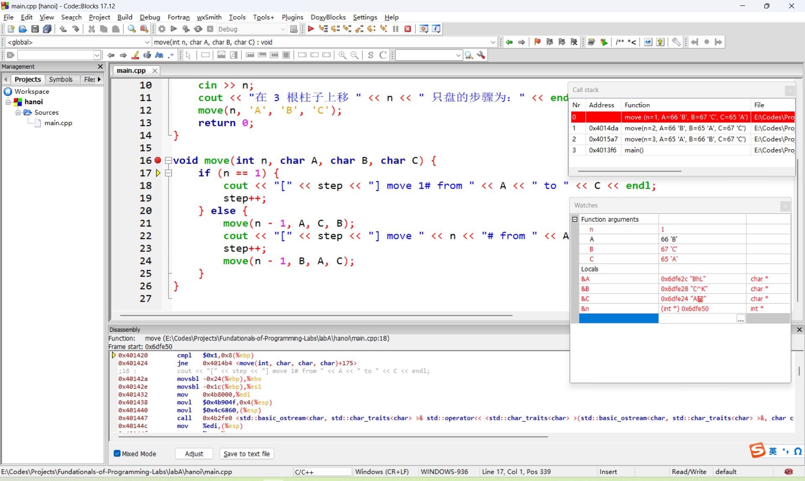

此时栈里再压入 `move(1, 'B', 'C', 'A')`，形参地址和内容如下，实参地址为父级调用中的形参地址。

|   项目   |    地址    |           内容            |
| :------: | :--------: | :-----------------------: |
|   `n`    | `0x6dfe50` |            `1`            |
|   `A`    | `0x6dfe2c` |           `'B'`           |
|   `B`    | `0x6dfe28` |           `'C'`           |
|   `C`    | `0x6dfe24` |           `'A'`           |
| 函数返回 | `0x4014da` |             -             |
|   输出   |     -      | `[5] move 1# from B to A` |

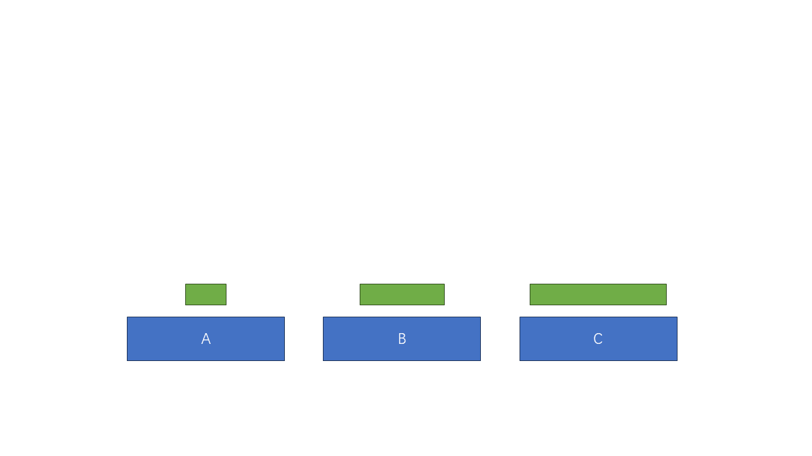

此时汉诺塔状态如上图。

---

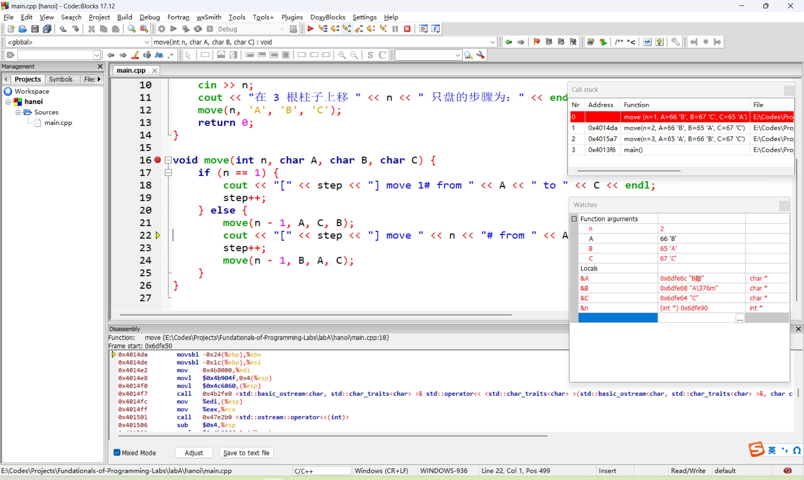

此时处理完 `move(1, 'B', 'C', 'A')`，将其出栈。

| 项目 | 地址 |           内容            |
| :--: | :--: | :-----------------------: |
| 输出 |  -   | `[6] move 2# from B to C` |


此时汉诺塔状态如上图。

---

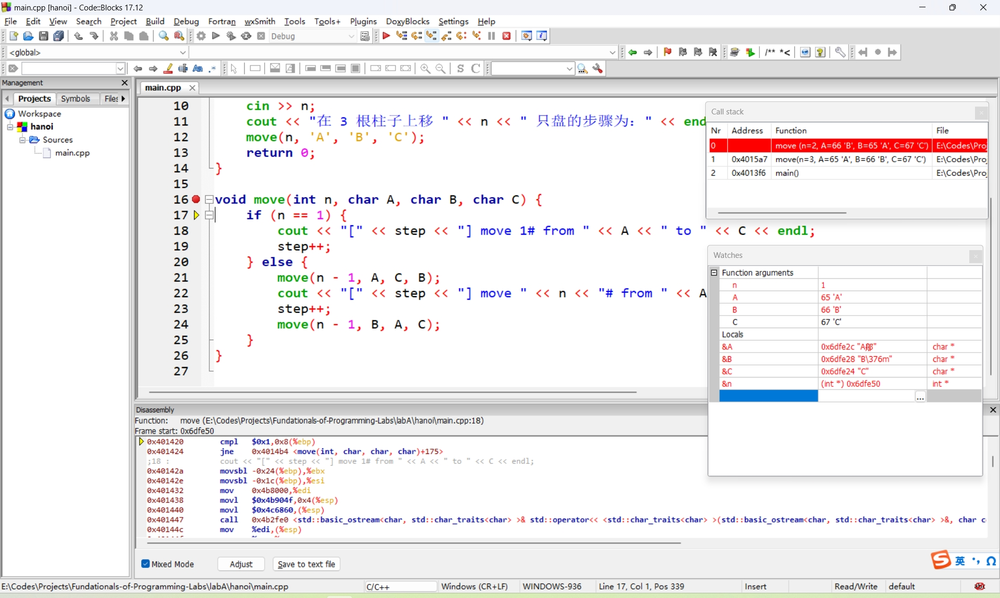

此时栈里再压入 `move(1, 'A', 'B', 'C')`，形参地址和内容如下，实参地址为父级调用中的形参地址。

|   项目   |    地址    |           内容            |
| :------: | :--------: | :-----------------------: |
|   `n`    | `0x6dfe50` |            `1`            |
|   `A`    | `0x6dfe2c` |           `'A'`           |
|   `B`    | `0x6dfe28` |           `'B'`           |
|   `C`    | `0x6dfe24` |           `'C'`           |
| 函数返回 | `0x4015a7` |             -             |
|   输出   |     -      | `[7] move 1# from A to C` |

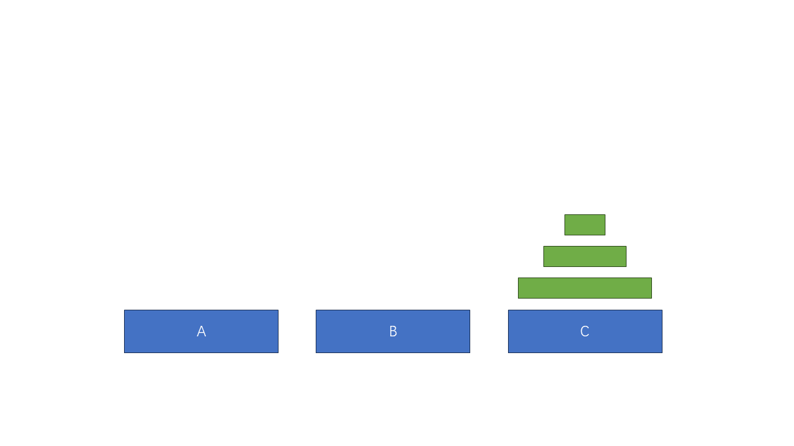

此时汉诺塔状态如上图。

---

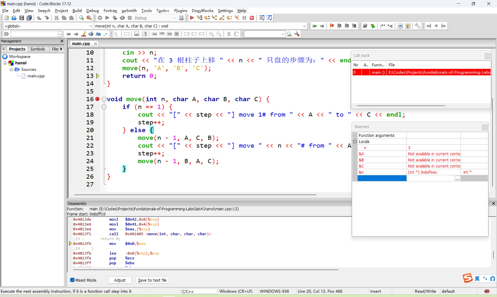

此时处理完 `move(1, 'A', 'B', 'C')`，将其出栈；

紧接着又处理完 `move(2, 'B', 'A', 'C')`，将其出栈；

最后也处理完了 `move(3, 'A', 'B', 'C')`，将其出栈；

返回 `main` 函数，最终程序结束。

### 最终结果

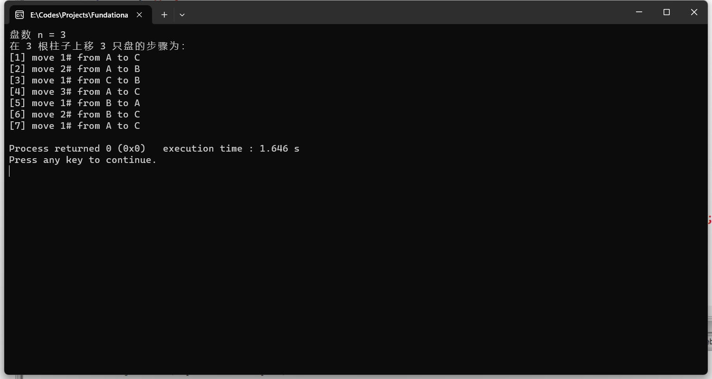

### 代码实现

```cpp
#include <iostream>
using namespace std;
int step = 1;

void move(int, char, char, char);

int main() {
    int n;
    cout << "盘数 n = ";
    cin >> n;
    cout << "在 3 根柱子上移 " << n << " 只盘的步骤为：" << endl;
    move(n, 'A', 'B', 'C');
    return 0;
}

void move(int n, char A, char B, char C) {
    if (n == 1) {
        cout << "[" << step << "] move 1# from " << A << " to " << C << endl;
        step++;
    } else {
        move(n - 1, A, C, B);
        cout << "[" << step << "] move " << n << "# from " << A << " to " << C << endl;
        step++;
        move(n - 1, B, A, C);
    }
}
```

